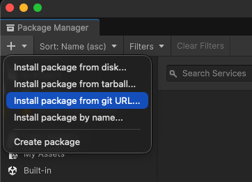
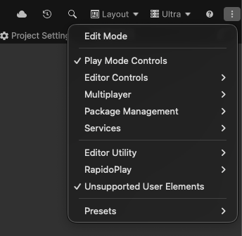
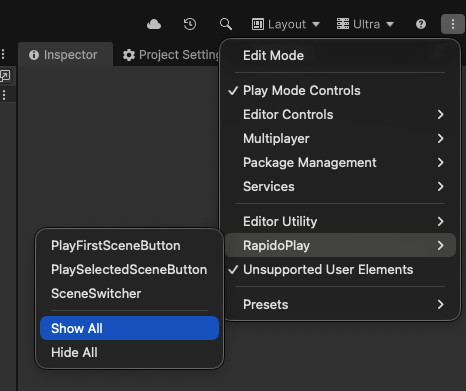

# RapidoPlay for Unity 6 🚀
# MyLocalization_UnityAsset
  

**RapidoPlay** is a lightweight, native extension for the Unity 6 Editor that brings lightning-fast scene switching and advanced Play Mode controls directly to your main toolbar. 

Built entirely on the new Unity 6 native `MainToolbarElement` API, it integrates seamlessly without using hacky reflection or breaking your UI layout.

## ✨ Features

* **Scene Switcher Dropdown:** A sleek, native dropdown that automatically populates with scenes from your active Build Profiles. Select a target scene or open it directly with one click.
* **Play First Scene:** Instantly enter Play Mode starting from the very first scene in your Build Settings (Index 0), perfect for bootstrapping your game regardless of what scene you are currently editing.
* **Play Selected Scene:** Play the specific scene you selected in the Scene Switcher, bypassing the currently open scene.
* **Native Feel:** Fully supports Unity's native Play/Stop states. Buttons visually toggle (turn blue) perfectly in sync with the standard Editor play controls.

---

## 📦 Installation

You can easily install this package via the Unity Package Manager (UPM).

1. Open Unity and go to **Window > Package Manager**.
2. Click the **+** (plus) button in the top left corner of the window.
3. Select **Add package from git URL...**
4. Paste the repository URL: `https://github.com/okhotnikov/RapidoPlay_UnityAsset.git` and click **Add**.

 

---

## 🛠️ How to Enable in Unity 6

In Unity 6, custom toolbar elements are hidden by default to keep the interface clean. You need to enable them manually after installation.

**Step 1:** Look at the top-right corner of the main Unity Editor toolbar and click on the **More (`⋮`)** menu icon (or simply right-click anywhere on the empty space of the toolbar).

**Step 2:** Scroll down the context menu until you find the **RapidoPlay** section.

**Step 3:** Check the boxes next to the tools you want to display:
* `Scene Switcher`
* `Play First Scene`
* `Play Selected Scene`

**Step 4 (Optional):** Once the buttons appear in the middle of your toolbar, you can hold `Ctrl` (or `Cmd` on macOS) and drag them left or right to reorder them to your liking!

---

## 🎮 Usage

Once enabled, the tools are extremely straightforward to use:

### The Scene Switcher
* **Click the button text ("Select Scene ▾")** to open the popup menu.
* **Click a Scene Name** in the list to "Select" it. The toolbar text will update to show your active selection.
* **Click the Scene Icon** (on the left side of the list) to immediately open and load that scene in the Editor.

### The Play Controls
* ▶️ **[1] Play First Scene:** Click to run your game from the initialization scene (Build Index 0).
* ▶️ **[★] Play Selected Scene:** Click to run your game from the scene currently displayed on the Scene Switcher button.

---

## ⚙️ Requirements
* **Unity 6000.0.x** or newer (Requires the new `UnityEditor.Toolbars` API).